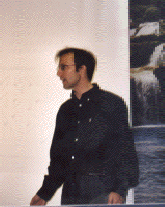

<!DOCTYPE HTML PUBLIC "-//W3C//DTD HTML 4.0 Transitional//EN">
<HTML>
<HEAD>
	<META HTTP-EQUIV="CONTENT-TYPE" CONTENT="text/html; charset=utf-8">
</HEAD>
<BODY LANG="fr-FR" TEXT="#000000" LINK="#0000ff" VLINK="#0000ff" BGCOLOR="#ffffff" DIR="LTR">

	<TABLE WIDTH=100% BORDER=0 CELLPADDING=0 CELLSPACING=2 STYLE="page-break-before: always">
		<TR>
			<TD>
				

			</TD>
			<TD>
				
<A HREF="http://www.cnrs.fr/"><B>Centre
				National </B><B> </B><B>de
				la Recherche </B><B> </B><B>Scientifique</B></A>
				 <B>UMR 5127</B>

			</TD>
			<TD>
				

			</TD>
			<TD>
				
<A HREF="http://www.lama.univ-smb.fr/"><B>Laboratoire
				</B><B> </B><B>de
				</B><B> </B><B>Mathématiques
				</B></A>
				

			</TD>
			<TD>
				

			</TD>
			<TD>
				
<A HREF="http://www.univ-smb.fr/"><B>Université
				de Savoie Mont Blanc</B></A>
				

			</TD>
		</TR>
	</TABLE>

<B>Laurent
VUILLON</B>

<B>Email
: Prénom.Nom@univ-smb.fr</B>

<A HREF="indexang.html"><B>English
version of the L. Vuillon's web page</B></A>

 Professeur à
l'Université de Savoie Mont Blanc

Equipe de Logique,
Informatique et Mathématiques Discrètes

	<TABLE BORDER=1 CELLPADDING=0 CELLSPACING=2>
		<TR>
			<TD>
				

					<TABLE BORDER=0 CELLPADDING=0 CELLSPACING=2>
						<TR>
							<TD WIDTH=100>
								

								<STRONG>Adresse:</STRONG>

							</TD>
							<TD WIDTH=300>
								

								 Laboratoire de Mathématiques
								 Université de Savoie
								 CNRS UMR 5127  73376
								Le Bourget du Lac  FRANCE
								
								

							</TD>
						</TR>
						<TR>
							<TD>
								

								<STRONG>Téléphone:</STRONG><B> </B><STRONG>Fax:</STRONG>

							</TD>
							<TD>
								
33
								(0)4 79 75 87 33  33
								(0)4 79 75 81 42 
								

							</TD>
						</TR>
					</TABLE>
				

			</TD>
		</TR>
	</TABLE>

&nbsp;

Enseignant-chercheur
en Mathématiques pour l’Informatique, en systèmes complexes et en
analyse de données et apprentissage statistique pour la biologie et les sciences humaines. Plus
de 60 articles scientifiques, 26 communications dans des colloques
internationaux et 86 communications dans des séminaires
scientifiques ou grand public.

Spécialiste
de combinatoire des mots, mathématiques discrètes, géométrie
discrète et des méthodes prédictives pour les domaines de la
biologie (prédiction des points faibles dans la structure 3D des
protéines et application aux maladies du vieillissement comme
l’Alzheimer et le Parkinson) et des sciences humaines (algorithmes
de détection de communautés et de clusterisation automatique). 

 Directeur
du laboratoire de mathématiques (LAMA) du 1er mars 2006 au 1er mars
2010 

 Directeur
de la fédération de laboratoires MSIF de septembre 2012 à janvier
2016 </A>

<A HREF="https://www.lama.univ-savoie.fr/index.php?page=Enseignement&lang=fr">&nbsp; Directeur du département de mathématiques depuis septembre 2018 à septembre 2022 </A>

      <A HREF="print.pdf">Participation
à un débat à l'Académie des sciences</A> <A HREF="print.pdf">le
mardi 15 mars 2005</A> 

<H2 CLASS="western" ALIGN=CENTER>Articles
et preprints</H2>

 <A HREF="articles.html">Articles
et preprints</A>

&nbsp;

<A HREF="archives.html"><B>ARCHIVES
</B></A>

<PRE STYLE="text-align: center">
Exposés

Journée du GDR IM en la mémoire de Maurice Nivat le 6 avril 2018

Exposé aux journées <A HREF="https://gopro2017.sciencesconf.org/">https://gopro2017.sciencesconf.org</A> sur la Gestion Optimisée de l'espace&nbsp;: des villes aux systèmes naturels

Organisateur avec Pierre-Louis Curien de la journée Maurice Nivat du l'IRIF le 6 février 2018

</PRE>

<H2 CLASS="western">  
</H2>
<H2 CLASS="western">Liste de mes
co-auteurs:</H2>

<A HREF="">M.
Achooch </A>(Marrakech, Maroc), <A HREF="http://ursula.chem.yale.edu/~batista/">V.S.
Batista </A>(Yale), <A HREF="http://www-igm.univ-mlv.fr/%7Eberstel/">J.
Berstel </A>(IGM,Marne-la-Vallée), <A HREF="https://www.irif.fr/~berthe/">V.
Berthé </A>(IRIF, CNRS, Paris 7), <A HREF="http://www.thales.math.uqam.ca/~blondin/">A.
Blondin Massé </A>(LACIM, UQAM, Montréal), <A HREF="http://www.ampere-lab.fr">L.
Bourgeat </A>(Ampére, Lyon), <A HREF="http://www.lacim.uqam.ca/%7Ebrlek/">S.
Brlek </A>(LACIM, UQAM, Montréal), <A HREF="http://www.unisi.it/">F.
De Carli </A>(Sienne, Italie),  <A HREF="https://www.pacte-grenoble.fr/membres/annette-casagrande">A.
Casagrande </A>(PACTE, IEPG, Grenoble), <A HREF="http://www.ens-lyon.fr/LIP/">F.
Chavanon </A>(LIP, ENS-Lyon), <A HREF="https://www.lama.univ-savoie.fr/index.php?lang=fr">B.
Colange </A>(CEA et LAMA, Chambéry), <A HREF="http://www.unisi.it/">A.
Del Lungo </A>(Sienne, Italie),  <A HREF="http://www.loria.fr/research/equipes/adagio">E.
Domenjoud </A>(LORIA, Nancy), <A HREF="http://www.inf.unideb.hu/~domosi/">P.
Domosi </A>(Debrecen, Hongrie), <A HREF="http://www.lama.univ-savoie.fr/">R.
Dorantes-Gilardi </A>(LAMA, Chambéry), <A HREF="http://www.labri.fr/Scripts/info.php?nom=44">S.
Dulucq </A>(LABRI,Bordeaux), <A HREF="http://www.denys-dutykh.com/">D.
Dutykh </A>(LAMA, CNRS, Chambéry), <A HREF="http://www-igm.univ-mlv.fr/%7Efagnot/">I.
Fagnot </A>(IGM,Marne-la-Vallée), <A HREF="https://ce.gatech.edu/people/Faculty/511/overview">F.
Fedele </A>(Gatech), <A HREF="https://www.linkedin.com/in/giovanni-feverati-719b5158">G.
Feverati </A>(Annecy), <A HREF="http://www.unisi.it/">A.
Frosini </A>(Sienne, Italie),  <A HREF="http://www.liafa.jussieu.fr/%7Ecf/">C.
Frougny </A>(LIAFA, Paris 8),  <A HREF="http://www.lif.univ-mrs.fr/">I.
Gambini </A>(LIF, Marseille), <A HREF="https://www.lama.univ-smb.fr">A.
Gheeraert </A>(LAMA, Chambéry et Univ. Bologna), <A HREF="http://iml.univ-mrs.fr/">P.
Hubert </A>(IML, Marseille),  <A HREF="http://www.inf.unideb.hu/~geza/">G.
Horvath </A>(Debrecen, Hongrie),  <A HREF="http://www.loria.fr/~jamet/">D.
Jamet </A>(LORIA, Nancy), <A HREF="http://www.liafa.jussieu.fr/">J.
Justin </A>(LIAFA, Paris), <A HREF="http://www.lirmm.fr/~labbe/">S.
Labbé </A>(LACIM, UQAM, Montréal), A.
Ladouceur,  <A HREF="http://www.liafa.jussieu.fr/%7Elatapy/">M.
Latapy </A>(LIAFA, CNRS, Paris), <A HREF="http://www.veille-strategique.org">H.
Lesca </A>(CERAG, Grenoble), <A HREF="http://www.ampere-lab.fr/spip.php?article957">C.
Lesieur </A>(AMPERE et IXXI, CNRS, Lyon), <A HREF="https://www.tiloshorizon.eu/cea/item/107-dr-sylvain-lespinats.html">S.
Lespinats </A>(CEA, Chambéry), <A HREF="http://www.crea.polytechnique.fr/personnels/fiches/magnien.htm">C.
Magnien </A>(LIAFA, LIX, Paris), <A HREF="http://www.liafa.jussieu.fr/%7Emairesse/">J.
Mairesse </A>(LIAFA, CNRS, Paris), <A HREF="http://www.ens-lyon.fr/LIP/">M.
Morvan </A>(LIP, ENS-Lyon),  <A HREF="http://www.academie-sciences.fr/Membres/N/Nivat_Maurice.htm">M.
Nivat </A>(LIAFA, Paris),  <A HREF="https://www.lama.univ-smb.fr">L.
Pacini </A>(Ampére et IXXI, Lyon et LAMA, Chambéry), <A HREF="http://www.labmath.uqam.ca/%7Epaquin/">G.
Paquin </A>(LACIM, UQAM, Montréal), <A HREF="https://www.lama.univ-smb.fr/pagesmembres/provencal/">X.
Provençal </A>(ETS,Montréal), <A HREF="http://www.liafa.jussieu.fr/%7Ephan/">H.
D. Phan </A>(LIAFA, Paris), <A HREF="http://perso.ens-lyon.fr/eric.remila/index.en.html">E.
Rémila </A>(LIP,ENS-Lyon), <A HREF="http://www.lirmm.fr/~richomme/">G.
Richomme </A>(LIRMM, Montpellier), <A HREF="http://www2.dsmi.unisi.it/newsito/infopersonali.php?mn=generale&amp;id=30">S.
Rinaldi </A>(Sienne, Italie), <A HREF="http://www.ens-lyon.fr/CHIMIE/recherche/Teams/Chimie_Theorique/members-old/ivan-rivalta">I.
Rivalta </A>(Univ. Bologna and ENS-Lyon), <A HREF="http://www.lacim.uqam.ca/~christo/">C.
Reutenauer </A>(LACIM, Montréal), <A HREF="https://www.listic.univ-smb.fr/presentation/membres/enseignants-chercheurs/kave-salamatian/">K.
Salamatian </A>(LISTIC, Annecy-le-Vieux), <A HREF="http://www.lama.univ-savoie.fr/">K.
Tawbe </A>(LAMA, Université de Savoie, Chambéry), <A HREF="http://www.di.ens.fr/~vergnaud/">D.
Vergnaud </A>(ENS Ulm, Paris), <A HREF="https://ce.gatech.edu/people/Faculty/511/overview">C.
Wymant </A>(Big Data Institute, Oxford),

CV
court 

1996
Doctorat de Mathématiques sous la direction du professeur Gérard
Rauzy à l'Université d'Aix-Marseille II. 

1997
ATER à Paris VII 

1998
Poste de Maître de conférences en Informatique au laboratoire LIAFA
de l'Université Paris-VII Jussieu. 

2001
Habilitation à diriger des recherches dans la discipline
Informatique Théorique sous la direction du professeur Maurice
Nivat. 

2003
Poste de professeur en Mathématiques au laboratoire LAMA de
l'Université de Savoie. 

2006-2010
Directeur du laboratoire LAMA CNRS UMR 5127. 

2012-2016
Directeur de la fédération de laboratoires MSIF. 

2018-2022
Directeur du département de mathématiques de l'USMB. 

<H3 CLASS="western"><A HREF="../Desktop">Retour
au site du LAMA</A></H3>
</BODY>
</HTML>
